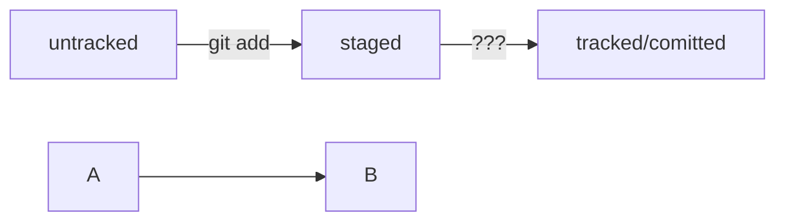

# practicum-traits

Данный репозиторий хранит мои шпаргалки для работы с git, GitHub и MD-файлами

Пока все эти шпаргалки хранятся в одном файле, но я предполагаю их разделить.

## GIT

### remote
``` bash
git remote add origin git@github.com:/repo  # привязка удаленного репозитория к локальному
git remote -v   # проверка связи репозиториев
```
Работа с удаленными репозиториями

### clone

``` bash
git clone git@github.com:/repo
```
Клонирование репозитория на локальный компьютер


### add

``` bash
git add -all                        # добавление в индекс всех файлов из папки
git add filename                    # добавление указанного файла в индекс
git add filename1 filename2 ...     # добавление заданных файлов в индекс
```
Добавление одного или нескольких файлов в индекс

### restore
``` bash
git restore --staged file           # отменить добавление файла file
git restore --staged .              # отменить добавление всех файлов текущей папки (.)
git restore file                    # отменить изменения в файле (до состояния перед git add или git commit)
```
Выполнить unstage изменений

### reset
``` bash
git reset --hard <commit hash>      # откатить состояние к заданному коммиту (с удалением последующих!!)
```
Откатить коммит

### commit

``` bash
git commit -?                       # запрос справки
git commit                          # выполнение коммита (с запросом описания)
git commit -a                       # включение в индекс измененных файлов и выполнение коммита
git commit -m 'Commit title'        # выполнение коммита с заданным описанием
git comment -amend [--no-edit]      # дополнение последнего коммита (--no-edit - не изменять комментарий)
git commit --amend -m 'new comment' # изменение комментария последнего коммита
```
Выполнение коммита

### push

``` bash
git push    # отправка изменений на удаленный репозиторий
git push -u origin master  # отправка данных и связывание локальной ветки и удаленной. Если удаленной ветви нет, она создается
```
Отправка данных на уделенный репозиторий

### pull
``` bash
git pull    # загрузка изменений с сервера
```
Загрузка изменений удаленного репозитория

### log
``` bash
git log             # сведения о коммитах
git log --oneline   # сведения в одну строку
```

### status
``` bash
git status          # отображение текущего статуса файлов
```

В Git файлы могут находиться в одном из двух состояний: 

**Отслеживаемым (tracked)** Об этих файлах Git знает и отслеживает изменения в них. Отслеживаемые файлы в свою очередь могут быть в следующих состояниях:  
**Неизменённым (unmodified)** То есть с момента последнего коммита в файле не было никаких изменений.  
**Изменённым (modified)** То есть с последнего коммита в файле были произведены какие-то изменения.  
**Подготовленным к коммиту (staged)** Это значит, что пользователь внёс изменения в файл и затем проиндексировал их, и эти изменения будут добавлены в следующий коммит. 
**Неотслеживаемым (untracked)** О неотслеживаемых файлах Git не знает, поэтому изменения в них не будут добавлены в коммит. Это любые файлы в рабочем каталоге, которые не входили в последний коммит и не подготовлены к текущему коммиту.  
Чтобы посмотреть статус текущих файлов, потребуется команда git status. Она выводит информацию о статусе файлов, находящихся в репозитории. 1



### config traits

``` bash
git config --global core.editor "nano"  # замена vim на nano
```
Некоторые настройки git

### common info

Статья на habr: https://habr.com/ru/companies/intel/articles/344962/

**Git hash** — уникальный идентификатор каждого коммита в репозитории Git. Он генерируется с помощью криптографической функции SHA-1 и представляет собой 40-символьную строку шестнадцатеричных символов (0–9 и a–f). Хеш коммита позволяет узнать его автора, дату и содержимое закоммиченных файлов. Он помогает Git отслеживать все изменения в репозитории. Хеш уникален и позволяет быстро обращаться к заданному коммиту.  

**HEAD** - заголовок. Используется репозиторием для определения того, что выбрано с помощью checkout.
Если субъект checkout — ветка, то HEAD будет ссылаться на нее, показывая, что имя ветки должно быть обновлено во время следующего коммита.
Если субъект checkout — коммит, то HEAD будет ссылаться только на него. В этом случае HEAD называется обособленным (detached)

**Как выйти из Vim-а**  
1. Нажмите клавишу **Esc**
2. Наберите последовательность символов **:qa!**
3. Нажмите **Enter**

## GIT HUB

### fork
Создание независимой копии внешнего репозитория в собственном аккаунте


## MD

Шпаргалка перенесена в отдельный файл - см. [файл](https://github.com/maxproof72/practicum-traits/blob/main/markdown-cheat-sheet.md)

